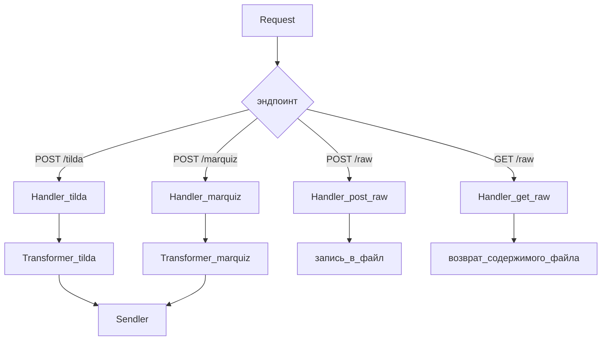
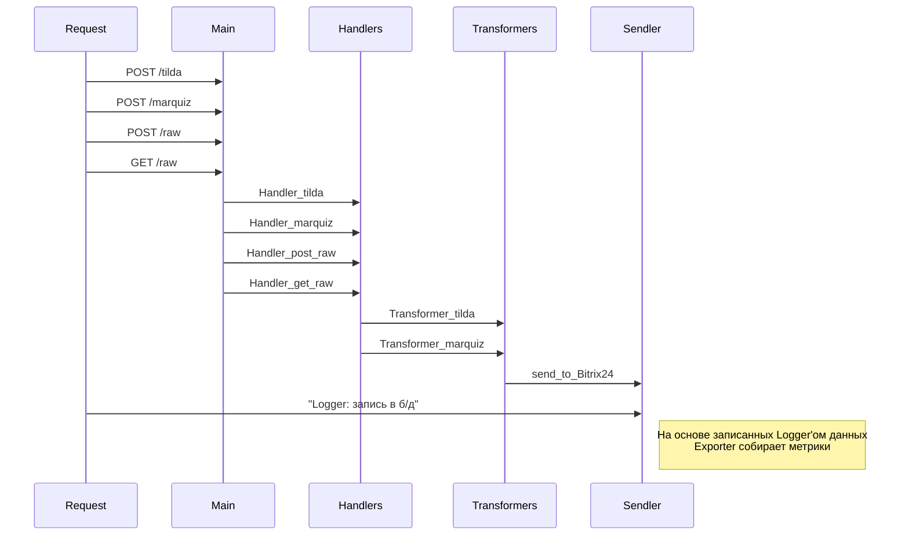

> **Note:** В контексте сказанного "сервер, который делает что угодно" и написанного мною про мой текущий проект (всё так реализовал на текущий момент у заказчика), рассуждаю следующим образом:
> - может сделать сервер, который принимает post-запросы с пары источников, которые есть в текущем проекте
> - т.к. источники присылают данные структурированные по-разному, то сервер все данные приводит к единому виду (JSON с нужным именованием элементов)
> - далее передаёт эти данные куда-то дальше
> - также логируется: входящие данные, результаты трансформации, статус отправки и ответа от получателя
> - можно добавить учёт: кол-ва входящих запросов, ошибок, может время обработки запросов (фиксация самого длительной обработки)

# Асинхронный прокси-трансформер запросов с метриками и логами
**Общее описание**
||Описание процессов|Сущности|
|-|-|-|
|1| принимает post- и get-запросы на указанные эндпоинты, логирование входящих данных |Main, Logger|
|2| обрабатывает данные из этих запросов: проверка структуры, проверка полученных данных (источник, параметры запроса, тело запроса), логирование обработки |Handler, Logger|
|3| формирует из этих данных запрос в соответствии с целевой структурой, логирование |Transformer, Logger|
|4| отправлят запрос по целевому пути, логирование статуса отправки и ответа |Sendler, Logger|
|5| учёт кол-ва входящих запросов, ошибок, исходящих запросов |Exporter|

## **Задачи на старте**
||||
|-|-|-|
|1| создать репозиторий|✅|
|2| перечислить сущности|✅|
|3| описать каждую сущность|🟥|
|4| составить список необходимых инструментов (библиотеки, фреймворки, базы данных)|🟥|
|5| описать исходящий запрос: структура, куда, как поступать в случае неполучения адресатом|✅|
|6| описать тестируемый функционал|🟥|
|7| описать флоу-диаграмму прохождения запроса|✅|

## **Перечисление сущностей**
||Название|Описание|
|-|-|-|
|1|Main|эндпоинты для post- и get-запросов, определение подходящего обработчика|
|2|Handlers|обработчик запросов: проверка соответствия, проверка данных|
|3|Transformers|формирование целевой структуры|
|4|Sendler|отправка сформированного запроса по целевому пути|
|5|Logger|логирование: входящих запросов, обработки запросов, формирования запроса, статуса отправки и получения запроса|
|6|Exporter|сборк метрик|

## **Список необходимых инструментов**
- boost.asio
- boost.json
- sqlite

## **Main**
> **Note:** В соответствии с тем, на какой эндпоинт пришёл запрос, вызывается соответствующий из Handler

||Эндпоинт|Описание|Соответствующий handler|
|-|-|-|-|
|1|POST /tilda|принимает запросы с tilda|Handler_tilda|
|2|POST /marquiz|принимает запросы с marquiz|Hadler_marquiz|
|3|POST /raw|принимает запросы для целей изучения структуры|Hadler_get_raw|
|4|GET /raw|возвращает информацию последнего запроса на POST /raw|Hadler_post_raw|

## **Handlers**
||Название|Функционал|
|-|-|-|
|1|Handler_tilda|Искомые элементы: name, phone (обязательно), email, utm_source_ utm_campaign, utm_medium, utm_content, utm_term|
|2|Hadler_marquiz|Искомые элементы: 'contacts':'name', 'contacts':'phone' (обязательно), 'contacts':'email', 'utm_tags':'utm_source', 'utm_tags':'utm_campaign', 'utm_tags':'utm_medium', 'utm_tags':'utm_content', 'utm_tags':'utm_term'|
|3|Hadler_get_raw|Записывает полученный запрос в файл|
|4|Hadler_post_raw|Возвращает информацию из файла, заполненного Hadler_get_raw|

## **Transformers**
> **Note:** Каждому из Handlers соответствует Transformers, который преобразует данные в соответствии с целевой структурой для исходящего запроса

## **Описание исходящего запроса**
> **Note:** Формирует JSON в соответсвии с требованиями Bitrix24 для post-запросов
> Запрос делается на вебхук предоставленный Bitrix24
> В случае ответа от адресата о невозможности принять данные, логируется ответ адресата и передаваемые данные
> В случае неполучения адресатом (нет ответа), запрос повторяется до момента получения адресатом: 5 раз через каждые 15 минут. Логируются все попытки отправки с номером попытки
> В случае удачи придёт ответ с номером созданного лида: записать это в лог
{
    "TITLE": String,
    "NAME": String,
    "PHONE": [["VALUE_TYPE": "OTHER", "TYPE_ID": "PHONE", "VALUE": Integer]]
    "EMAIL": [["VALUE_TYPE": "OTHER", "TYPE_ID": "EMAIL", "VALUE": String ]]
}

## **Sendler**
> **Note:** Запрос делается на вебхук предоставленный Bitrix24
> Один запрос = один лид
> У Bitrix24 есть ограничение: не более 2 запросов в 1 сек, чтобы счётчик запросов успевал обнульяться (https://apidocs.bitrix24.ru/limits.html)
> **На будущее:** Bitrix24 позволяет делать запросы пакетом. Это позволяет накопить лиды, а потом одним запросом отправить

## **Exporter**

## **Описание тестируемого функционала**

## **Описание прохождения запроса**

## **Описание всего процесса**

